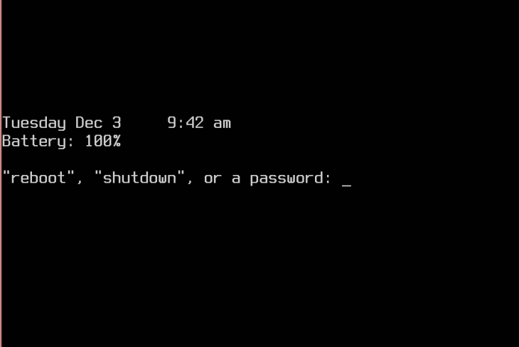

vislock will lock physical access to a linux computer by disabling
all of its virtual terminals.  (vislock is a direct extension of
the now-archived physlock project.)

vislock allows any active user of the local machine, as well as
others mentioned on the command line (e.g., root) to unlock the
computer.  vislock uses PAM for authentication.

vislock uses two mechanisms to find the local active users.  Which
mechanism to use is determined at compile time (see the Makefile).

- Querying systemd-logind(1) or elogind(8) for non-remote, active,
    users (if compiled with either `HAVE_SYSTEMD=1` or
    `HAVE_ELOGIND=1`).

- Searching the utmp file for entries whose `ut_line` field
    represents a VC (ttyN).

Without options, the lock screen consists of just a simple "password:"
prompt.  It can also show the time, a laptop's battery level, and can
even allow shutdown/reboot directly from the lock screen.  (I've
always been frustrated by lock screens that don't have these basic
features.)

Note that ssh, or other network access, is unaffected by vislock.

Installation
------------
vislock is built and installed using:

    $ make
    # make install

By default, vislock is installed to `/usr/local`, so the full path of
the executable will be `/usr/local/bin/vislock`.  Modify this using:

    # make PREFIX="/your/dir" install

vislock will be installed as setuid-to-root.

All build-time specific settings are in the file `config.def.h`.
Check and change them as needed.

You also have to make sure that vislock works with your PAM
configuration.  If you have a restrictive PAM fallback config file
`/etc/pam.d/other`, then you need to create a suitable PAM config file
for vislock named `/etc/pam.d/vislock`.  The sample `vislock.pam`
should work for most users.

Usage
-----
The behavior of vislock is completely controlled by command-line
arguments.  vislock uses either logind or utmp to identify the active
local users on the machine.  Any of their passwords will unlock the
computer.

Display options:
  -p MSG    display MSG at top of lock screen
  -t        display time-of-day on lock screen
  -b        display battery level on lock screen
  -n        display names of unlocking users on lock screen
  -c        allow shutdown/reboot commands on lock screen
  -f FONT   specify file containing lock screen font (full path)
  -o MINUTES set a screen-blanking timeout
  -m        mute kernel messages while running

Configuration:
  -u USER   add USER to the "allowed to unlock" list (can be repeated)
  -s        disable sysrq while running
  -d        fork and detach process, useful in scripts when suspending

Debug:
  -l        disable console switching and exit
  -L        enable console switching and exit (useful after crash)

Misc:
  -v        version
  -h        help

History
-------
I've always been frustrated both by the a) complexity, and b) lack of
flexibility of modern screen lockers and power managers.  I've
implemented my own primitive variants over the years, with varying
levels of success.  Mainly they've barely done what I needed, and
little more.  When I found physlock, it fit my needs perfectly...
almost.  So I've added the things that I've wanted, fixed the bugs
I've caused, and maybe one or two others (not clear on those ;-), and
it "Works for Me", as they say.

I invoke vislock from a script in /etc/acpi (for lid closures), and
from a small inactivity-detecting daemon I wrote a while ago.  Other
use cases are completely untested, but I haven't really changed any of
the physlock underpinnings, so it's probably as fine as it ever was.

Bear in mind that physlock itself has a long history, and an issues
page to back it up.  Many or most of the open issues on the physlock
project may well apply to vislock as well.  Unless they affect me
personally, I probably won't spend a lot of time on them, but I'm
happy to consider patches.

A simple wrapper script, "run_vislock", is included in the sources.  I
find it helps to keep my preferred invocation options in one place.

